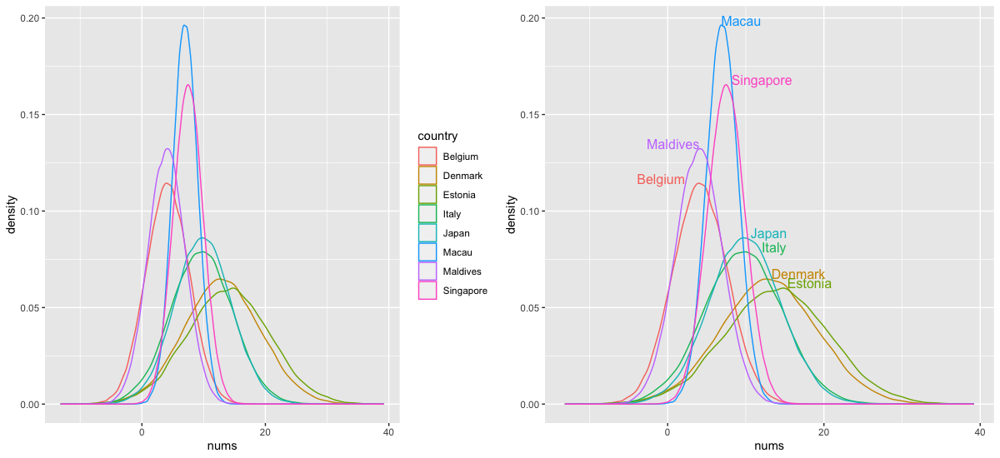
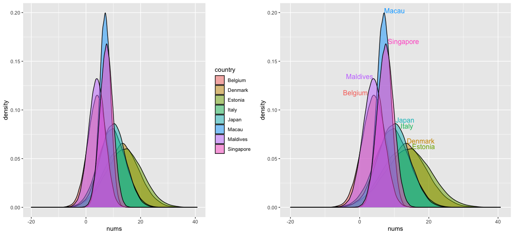

Easy Test
---

For illustration of a hard-to-decipher/confusing legend, I've created a density plot (via `geom_density()`) which figuratively compares the population densities of some countries as per [this data](https://en.wikipedia.org/wiki/List_of_countries_and_dependencies_by_population_density): (I randomly picked a few countries, while maintaining the rank in between them)
```r
library(ggplot2)
library(gridExtra)
library(directlabels)
# For separate data frames, I am generating some data following a normal distribution which correctly accounts for the relative population density order of the country represented in another categorical variable: (Higher the density peak, lower the standard deviation)
c1 <- data.frame(nums = rnorm(100000, 7, 2), country = "Macau")
c2 <- data.frame(nums = rnorm(85000, 7.5, 2.4), country = "Singapore")
c3 <- data.frame(nums = rnorm(77000, 4, 3), country = "Maldives")
c4 <- data.frame(nums = rnorm(72000, 4.2, 3.5), country = "Belgium")
c5 <- data.frame(nums = rnorm(54000, 9.9, 4.6), country = "Japan")
c6 <- data.frame(nums = rnorm(51500, 9.6, 5), country = "Italy")
c7 <- data.frame(nums = rnorm(37800, 13, 6.2), country = "Denmark")
c8 <- data.frame(nums = rnorm(31400, 14, 6.6), country = "Estonia")
cases <- rbind(c1, c2, c3, c4, c5, c6, c7, c8)
g <- ggplot(cases, aes(nums, color = country)) + geom_density()
grid.arrange(g, direct.label(g), ncol = 2)
```

The plot without direct labelling on the left provides the classic 'hard to decode' example, wherein the viewer has to look hard and one by one, associate the lines with their respective colors provided by the legend. With direct labels, one does not have to bother about visually decoding the variable associations, as evident from the plot on the right. Not only are the labels in close proximity to the lines they represent, but they are also suitably positioned/adjusted in height, supplementing the diagnostic information to remove any ambiguity that may arise when comparing labels between two peaks that are close to each other. (for e.g., consider Japan & Italy in the plots above; lower peak -> lower positioned label => Italy's color line is below that of Japan's) 

Rather than going the hard way (left) for decoding, it makes more sense to just use `direct.label(plot.obj)` and conveniently obtain a result which is much easier to comprehend.

I've used `color` above which essentially just outlines the data, so here's a replacement with `fill`: 
```r
g <- ggplot(cases, aes(nums, fill = country)) + geom_density(alpha = 0.5)
grid.arrange(g, direct.label(g), ncol = 2)
```


Notice that by setting some opacity (`alpha` < 1) above, I've inherently avoided the issue of overshadowing between two countries, such as in the case of Maldives and Belguim, wherein the former would cover the latter, making the peak of Belgium non-existent or visually indiscernible. 

But hold on, that's not the end of the issue! It gets even more confusing after applying a bit of transparentness to the fills, as because the colors assigned to these categorical variables change when they overlap with one another. For instance, have a good look at the plot on the left and by comparing, try to figure out where Singapore is, in accordance with the color-country pair given by the legend. I'm pretty sure you've mistaken Belgium (fourth highest peak, to the extreme left) to be Singapore, because that's almost the same color (a shade of pink) being used to represent Singapore by the legend, which apparently was not assigned to Belgium as its base color, but instead got discolored by intermingling with other colors (especially the one associated with Maldives). 

This is downright confusing. In fact, in order to even recognize those countries on the left plot (with reference to what I'm trying to convey), you probably had to look at the direct-labelled plot on the right first! <br>
This is why direct labels are so useful, as they become a hard requisite to solve such perplexing cases, apart from offering visual convenience in regular cases.