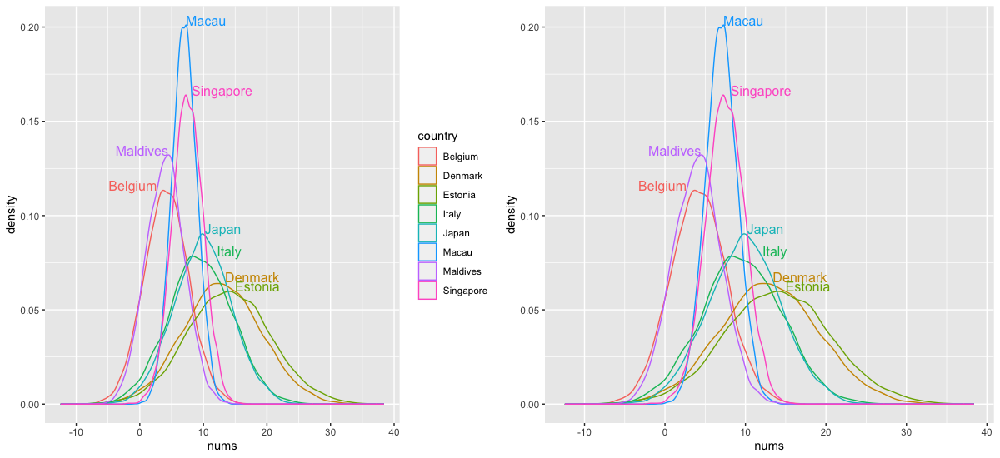

Easy Test
---

For illustration of a hard-to-decipher/confusing legend, I've created a density plot (via `geom_density()`) which figuratively compares the population densities of some countries as per [this data](https://en.wikipedia.org/wiki/List_of_countries_and_dependencies_by_population_density): (I randomly picked a few countries, while maintaining the rank in between them)
```r
library(ggplot2)
library(gridExtra)
library(directlabels)
# For separate data frames, I am generating some data following a normal distribution which correctly accounts for the relative population density order of the country represented in another categorical variable: (Higher the density peak, lower the standard deviation)
n <- 10000
c1 <- data.frame(nums = rnorm(n, 7, 2), country = "Macau")
c2 <- data.frame(nums = rnorm(n, 7.5, 2.4), country = "Singapore")
c3 <- data.frame(nums = rnorm(n, 4, 3), country = "Maldives")
c4 <- data.frame(nums = rnorm(n, 4.2, 3.5), country = "Belgium")
c5 <- data.frame(nums = rnorm(n, 9.9, 4.6), country = "Japan")
c6 <- data.frame(nums = rnorm(n, 9.6, 5), country = "Italy")
c7 <- data.frame(nums = rnorm(n, 13, 6.2), country = "Denmark")
c8 <- data.frame(nums = rnorm(n, 14, 6.6), country = "Estonia")
cases <- rbind(c1, c2, c3, c4, c5, c6, c7, c8)
g <- ggplot(cases, aes(nums, color = country)) + geom_density()
grid.arrange(g, direct.label(g), ncol = 2)
```

The plot without direct labelling on the left provides the classic 'hard to decode' example, wherein the viewer has to look hard and one by one, associate the lines with their respective colors provided by the legend. With direct labels, one does not have to bother about visually decoding the variable associations, as evident from the plot on the right. Not only are the labels in close proximity to the lines they represent, but they are also suitably positioned/adjusted in height, supplementing the diagnostic information to remove any ambiguity that may arise when comparing labels between two peaks that are close to each other. (for e.g., consider Japan & Italy in the plots above; lower peak -> lower positioned label => Italy's color line is below that of Japan's) 

Rather than going the hard way (left) for decoding, it makes more sense to just use `direct.label(plot.obj)` and conveniently obtain a result which is much easier to comprehend.

I've used `color` above which essentially just outlines the data, so here's a replacement with `fill`: 
```r
g <- ggplot(cases, aes(nums, fill = country)) + geom_density(alpha = 0.5)
grid.arrange(g, direct.label(g), ncol = 2)
```


Notice that by setting some opacity (`alpha` < 1) above, I've inherently avoided the issue of overshadowing between two countries, such as in the case of Maldives and Belguim, wherein the former would cover the latter, making the peak of Belgium non-existent or visually indiscernible. 

But hold on, that's not the end of the issue! It gets even more confusing after applying a bit of transparentness to the fills, as because the colors assigned to these categorical variables change when they overlap with one another. For instance, have a good look at the plot on the left and by comparing, try to figure out where Singapore is, in accordance with the color-country pair given by the legend. I'm pretty sure you've mistaken Belgium (fourth highest peak, to the extreme left) to be Singapore, because that's almost the same color (a shade of pink) being used to represent Singapore by the legend, which apparently was not assigned to Belgium as its base color, but instead got discolored by intermingling with other colors (especially the one associated with Maldives). 

This is downright confusing. In fact, in order to even recognize those countries on the left plot (with reference to what I'm trying to convey), you probably had to look at the direct-labelled plot on the right first! <br>
This is why direct labels are so useful, as they become a hard requisite to solve such perplexing cases, apart from offering visual convenience in regular cases.

- Using `directlabels::geom_dl()` instead of `directlabels::direct.label()`:

Like the labelled plots above, I'm using the `top.bumptwice` positioning method, which is the [default](https://github.com/tdhock/directlabels/blob/54ccbb95e0079649d350865f8c063adfc8fbbf0b/R/ggplot2.R#L309) (mentioning here since `geom_dl()` requires a positioning method to be specified), and arguably produces the best results for a density plot:
```r
g1 <- ggplot(cases, aes(nums, color = country)) +
      geom_density() + 
      geom_dl(aes(label = country), method = "top.bumptwice", stat = "density")
g2 <- g1 + theme(legend.position = "none")
grid.arrange(g1, g2, ncol = 2)
```


The one to the left includes both direct labels and a legend, while the one to the right solely delineates direct labelling (either way, direct labels are sufficient). 

Note that it becomes necessary to explicitly state `stat = "density"` here, which was the key takeaway for me this morning while trying to use `geom_dl()` for my plot.

<details>
<summary> Explanation </summary> 

Initially, I ran into an error which indicated a missing y aesthetic:

```r
g + geom_dl(aes(label = country), method = "top.bumptwice")
Error: geom_dl requires the following missing aesthetics: y
Run `rlang::last_error()` to see where the error occurred.
``` 

Given that `inherit.aes` is true by [default](https://github.com/tdhock/directlabels/blob/54ccbb95e0079649d350865f8c063adfc8fbbf0b/R/ggplot2.R#L27) and I only required to specify the grouping variable for `label` plus the positioning method, I assumed that simply mentioning these parameters would work, prior to executing the above line. (I was aware that I did not require to state/assign a value for the `y` aesthetic in my ggplot object for my density plot, which led to this assumption, supplemented by the fact that `direct.label()` worked without that as well) 

Values for the y aesthetic can be either unitary (e.g. `y = 0.2`) in length or have the length of the data (e.g. `y = country`), but plotting this way by explicitly mentioning a `y` aesthetic in `geom_dl()` for a density plot would shift the labels to the top, governed by the corresponding `y` value provided. (I figured this happens because internally the labelling is done considering the `y` aesthetic) This indicates that I was clearly missing something.

As it turns out, there are two distinct cases of `geom_density()` based on the `stat` specification, namely `density` (default) and `identity`. The former makes the function compute its `y` values based on the frequency distribution of the given `x` values (in my case, the `rnorm()` generated data), which is internally applied while using `direct.labels()`, without the need to explicitly mention `stat = "density"`. But in the case of `geom_dl()`, apparently one needs to specify this selection, otherwise it expects a `y` aesthetic (as if `stat = "identity"`, which expects the `y` value to be provided for mapping), which it shouldn't in the first place for my case given that I want the `y` values to be computed automatically with respect to the `x` values I provided (`nums`). 

In conclusion, the key takeaway for me while using `geom_dl()` in the case of my density plot was to be aware of the `y` aesthetic passed onto it. 

</details>